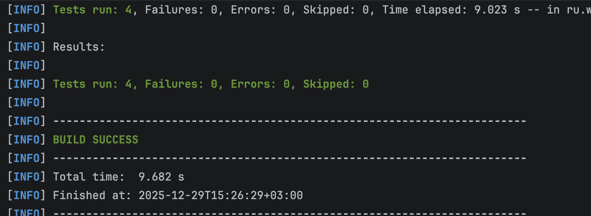

# Тестирование приложений

Выполнил Дронов Егор

## Описание проекта
Проект содержит автоматизированные тесты для:
1. Веб-сайта ru.wikipedia.org (4 теста)
2. Мобильного приложения Wikipedia (3 теста)

## Технологии
- Java 21
- Selenium WebDriver
- Appium
- TestNG
- Maven

## Требования
1. Установить Java 21+
2. Установить Maven
3. Установить Chrome браузер
4. Для мобильных тестов:
  - Установить Appium: `npm install -g appium`
  - Установить Android Studio
  - Создать эмулятор Android
  - Установить приложение Wikipedia на эмулятор

## Запуск тестов
```bash
mvn clean test
```


### 1. Веб-тесты (сайт ru.wikipedia.org)
```bash
mvn test -Dtest=WikipediaTests
```

### 2. Мобильные тесты (Wikipedia)
Приложение скачано [app-alpha-universal-release.apk](https://github.com/wikimedia/apps-android-wikipedia/releases/tag/latest)
- Запуск Android эмулятора
    ```bash
    emulator -avd Pixel_5
    ```
- Загрузка приложения на эмулятор
```bash
adb -s emulator-5554 install app-alpha-universal-release.apk
```
- Запуск Appium сервера
    ```bash
    appium -p 4723
    ```
- Запуск тестов
```bash
mvn test -Dtest=WikipediaMobileTests
```


